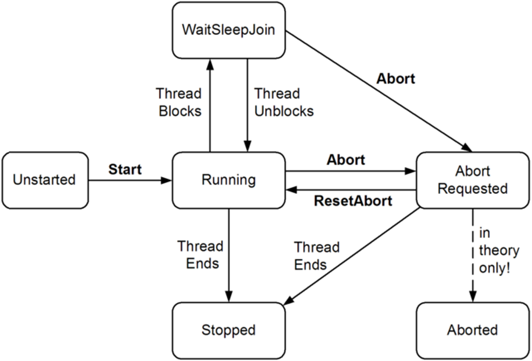

# Thread
- 스레드 만들기   
    ```
    bool IsRunningThread = false;
    protected System.Threading.Thread Thread1;
    ....

    IsRunningThread = true;
    Thread1 = new System.Threading.Thread(ThreadFunc);
    Thread1.Start();
    ....

    protected void ThreadFunc()
    {
        while (IsRunningThread)
        {
            ......
        }
    }
    ```
    
- 스레드 함수에 인자를 전달
    ```
    bool IsRunningThread = false;
    protected System.Threading.Thread Thread1;
    ....

    IsRunningThread = true;
    Thread1 = new System.Threading.Thread(ThreadFunc);
    int value = 1;
    Thread1.Start(value);
    ....

    protected void ThreadFunc(object parameter)
    {
        var value = (int)parameter;
        
        while (IsRunningThread)
        {
            ......
        }
    }
    ```  
      
- join과 sleep
    ```
    Thread t = new Thread(Go);
    t.Start();
    ....
    t.Join();  // t 스레드가 끝날 때까지 대기
    ```
    - Thread.Sleep(0)와 Thread.Yield()는 다른 스레드에 CPU 타임을 양보한다.
    - 차이점은 Thread.Yield()은 깉은 프로세서에서 실행되고 있는 스레드에 대해서만 CPU 타임을 양보한다는 것이 다르다.
    - Sleep(0)과 Yield는 최적화 작업이나 디버깅에서 유용할 때가 있다.
    - 만약 Thread.Yield()를 프로그램의 다양한 곳에서 사용되는 경우 프로그램이 실행 도중 크래쉬가 발생한다면 스레드 처리에 문제가 있다고 봐도 괜찮다.
  

<br>     
    
## 스레드의 동작
- 멀티스레드는 내부적으로 스레드 스케쥴러에 의해서 관리.
- CLR은 보통 이 기능을 OS의 기능을 이용하는 형태로 제공.
- 스레드 스케쥴러는 모든 스레드가 올바르게 실행 시간을 할당 받도록 각 스레드를 관리하고, 또 대기 상태나 블럭된 스레드(ExclusiveLock 등)가 쓸데 없이 CPU를 소비하지 않도록 한다.
- 프로세서가 하나밖에 없는 컴퓨터의 경우 스레드 스케쥴러는 타임 슬라이스를 한다.
- 타임 슬라이스는 고속으로 실행하는 스레드를 바꾸어 가면서 복수의 애플리케이션이 동시에 실행하고 있는 것처럼 보여준다.
    - Windows에서 타임 슬라이스는 보통 수 10ms 정도.
- 프로세서가 2개 이상인 경우 멀티스레드는 타임 슬라이스와 서로 다른 스레드가 서로 다른 CPU에서 각각 병렬로 실행된다. 프로세서 수와 상관 없이 타임 슬라이스를 한다. 최소한 OS 자신의 스레드도 실행되어야 하기 때문이다.
    
    
  

<br>     
 
## 스레드에 이름 붙이기
  
```
class ThreadNaming
{
    static void Main()
    {
        Thread.CurrentThread.Name = "main";
        Thread worker = new Thread (Go);
        worker.Name = "worker";
        worker.Start();
        Go();
    }
 
    static void Go()
    {
        Console.WriteLine ("Hello from " + Thread.CurrentThread.Name);
    }
}
```  
  
  
<br>       
    
## 포그라운드와 백그라운드
- 직접 만든 스레드는 보통 포그라운드 스레드이다.
- 포그라운드가 스레드가 하나라도 실행 중이라면 프로그램은 종료 되지 않는다.
- 모든 포그라운드 스레드가 종료되어 프로그램이 종료될 때 백그라운드 스레드가 실행 중인라면 백그라운드 스레드는 강제 종료된다.
  
```
class PriorityTest
{
  static void Main (string[] args)
  {
     Thread worker = new Thread ( () => Console.ReadLine() );
     
     if (args.Length > 0)         worker.IsBackground = true;
     
     worker.Start();
  }
}
```  
인수와 함께 프로그램을 실행하면 worker 스레드가 백그라운드 스레드가 되어서 메인 스레드가 종료되면서 같이 종료된다.  
반대로 인수가 없으면 포그라운드 스레드가 되어서 worker가 종료될 때까지 프로그램 종료는 대기.  
 
   
### 백그라운드 스레드가 끝날 때까지 명시적으로 대기하고 싶다면
1. 자신이 만든 스레드의 경우는 join 메소드로 스레드 종료까지 대기한다.  
2. 스레드 풀의 스레드라면 EventWaitHandle을 사용한다.    
    
  
<br>       
     
## 스레드 우선도
스레드 우선 값  
```
enum ThreadPriority 
{ 
   Lowest, BelowNormal, Normal, AboveNormal, Highest 
}
```
  
스레드 우선도 변경은 아주 조심해야 한다. 우선도 변경에 의해서 다른 스레드의 동작에 악영향을 미칠 수 있다.  
  
스레드 우선도를 높여도 즉각적으로 반영 되는 것은 아니다.  
왜냐면 스레드는 애플리케이션의 프로세스 우선도 안에서 동작하기 때문이다.   
그래서 스레드 우선도을 높이는 경우 프로세스 우선도도 높일 필요가 있다.  
```
using (Process p = Process.GetCurrentProcess())
{
    p.PriorityClass = ProcessPriorityClass.High;
}
```  
     
  
<br>       
  
## 콜백 델리게이트를 사용하여 스레드 통신
  
```
class MainClass
{
    public static void Main()
    {
        ThreadInfo info = new ThreadInfo(1000,
            new ThreadInfo.MyThreadCallback(GetCallbackResult));

        var t = new Thread(new ThreadStart(info.MyThreadMethod));
        t.Start();

        Console.ReadLine();
    }

    private static void GetCallbackResult(int returnValue)
    {
        Console.WriteLine(returnValue);
    }
}

class ThreadInfo
{
    // 스레드 결과를 넘기기 위한 콜백 델리게이트
    public delegate void MyThreadCallback(int returnValue);
    private MyThreadCallback callbackDelegate;
    
    public int SleepTime;

    public ThreadInfo(int stime, MyThreadCallback callback)
    {
        this.SleepTime = stime;
        this.callbackDelegate = callback;
    }

    public void MyThreadMethod()
    {
        System.Threading.Thread.Sleep(this.SleepTime);

        // 콜백 델리게이트를 실행해서 결과를 넘긴다 
        if (this.callbackDelegate != null)
        {
            this.callbackDelegate(System.Environment.TickCount);
        }
    }
}
```  
  
<br>       
  
## 예외 처리
**워크 스레드에서 예외가 발생했으므로 메인 스레드에서 예외가 잡히지 않는다**  
```
public static void Main()
{
    try
    {
        new Thread (Go).Start();
    }
    catch (Exception ex)
    {
        Console.WriteLine ("Exception!");
    }
} 
static void Go() 
{ 
    throw null; // NullReferenceException를 발생
}
```   
  
예외를 잡으려면 아래 코드처럼 변경한다  
```
public static void Main()
{
   new Thread (Go).Start();
} 


static void Go()
{
    try
    {
        throw null;
    }
    catch (Exception ex)
    {
        ...
    }
}
```    

애플리케이션 전체의 예외 핸들을 하는 이벤트로 WPF와 WindowsForm에서는  
- Application.DispatcherUnhandledException
- Application.ThreadException  
가 있다.   
  
이 이벤트는 메인스레드에서의 예외만 핸들링 할 수 있다. 워크스레드에서의 예외는 자기자신이 핸들링하여 적절한 처리를 해야 한다.  
AppDomain.CurrentDomain.UnhandledException에서는 모든 스레드에서 발생한 예외를 핸들링 할 수 있다.  


  
<br>         

## 스레드 로컬 스토리지(TLS)

```
class Class1
{
    private static LocalDataStoreSlot slot;

    static void Main()
    {
        // 모든 스레드에 데이터 슬롯을 할당한다
        slot = System.Threading.Thread.AllocateDataSlot();

        // 메인 스레드의 슬롯 내용을 설정
        System.Threading.Thread.SetData(slot, "안녕하세요");

        // Thread 오브젝트를 만든다
        var t =  new Thread(new ThreadStart(DoSomething));
        t.Start();

        t.Join();
        // 메인 스레드의 슬롯 내용을 얻는다
        string str = (string) System.Threading.Thread.GetData(slot);
        Console.WriteLine(str);

        Console.ReadLine();
    }

    private static void DoSomething()
    {
        // 다른 스레드의 슬롯 내용을 설정
        System.Threading.Thread.SetData(slot, "다음에 만나요");

        // 다른 스레드의 슬롯 내용을 얻는다
        string str = (string) System.Threading.Thread.GetData(slot);
        Console.WriteLine(str);
    }
}
```   