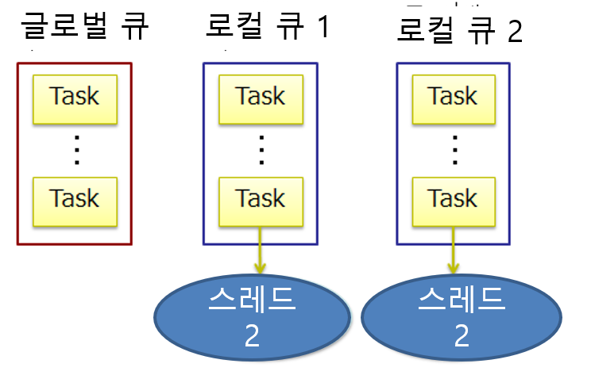

# Thread Pool
- 스레드를 새로 시작하면 그 스레드 전용 스택 메모리(보통 1MB) 확보 등으로 수백 마이크로초 정도의 CPU 시간을 소비한다.
- 스레드풀은 한번 만든 스레드를 재 이용하여 공유하는 것으로 위의 오버헤드를 회피한다.
- 스레드풀은 동시에 실행하는 스레드의 총 수가 너무 증가하지 않도록 조정하는 역할도 가지고 있다.
- 동시 실행하는 스레드 수가 너무 많아지면 OS의 스레드 관리 부하가 너무 높아져서 CPU 캐시 동작이 비효율적으로 된다.
- 스레드 풀은 동시 실행하고 있는 스레드 수의 한계에 도달하면 새로운 실행 job은 큐에 들어가고 실행 중의 job 중 하나가 끝날 때까지 대기한다.


## 스레드풀을 사용하는 곳 
- Task Parallel Library의 내부
- ThreadPool.QueueUserWorkItem 메소드 호출
- Asynchronous delegate의 내부
- BackgroundWorker의 내부
  

## 스레드풀을 간접적으로 사용하는 곳 
- WCF, Remoting, ASP.NET, ASMX Web Service
- System.Timers.Timer, System.Threading.Timer
- Async로 끝나는 메소드. 예를들면 WebClient 클래스의 메소드 (Event-based asynchronous pattern)
- Begin으로 시작하는 메소드의 대부분（Asynchronous programming pattern）
- PLINQ
  
  
## 스레드풀의 주의할 점
- 스레드 풀의 스레드에는 이름을 붙일 수 없다. 그래서 디버깅시 불편한 경우가 있다.
- 스레드는 모두 백 그라운드 스레드로서 실행된다.
- 스레드를 블럭하면 ThreadPool.SetMinThreads를 부르지 않는한 빠른 단계로 지연이 발생한다.
- 스레드 우선도는 자유롭게 변경할 수 있다. 스레드 실행이 종료하여 스레드 풀에 돌아가는 타이밍에서 스레드 우선도는 모두 Normal로 자동적으로 복원된다.
  

## 스레드풀 이용
- Task Parallel Library를 이용하지 않는 경우라면 ThreadPool.QueueUserWorkItem나 asynchronous delegates 두 중의 하나를 사용한다.
- 두 개의 차이는 asynchronous delegates는 반환 값을 돌려주는 것과 모든 예외를 호출한 곳에 보내는 부분이 서로 다른다.
  
  
## QueueUserWorkItem
  
```
static void Main()
{
  ThreadPool.QueueUserWorkItem (Go);
  ThreadPool.QueueUserWorkItem (Go, 123);
  Console.ReadLine();
}
 
static void Go (object data)
{
    Console.WriteLine ("Hello from the thread pool! " + data);
}
```  
- WaitCallback delegate 정의에 맞추기 위해서 Go 메소드는 data 라는 object 타입의 인수를 하나 가진 메소드가 되었다. 
- QueueUserWorkItem은 반환 값을 돌려줄 방법이 없다. 또 예외처리를 적절하게 구현하지 않아서 미처리 예외가 발생한 경우 프로그램이 자동적으로 종료시킨다.

   
## 락 프리 ThreadPool
구 버전의.NET Framework에서는 각 애플리케이션 스레드의 글로벌 FIFO 작업 큐가 ThreadPool 에 보존 되었다. 프로그램이 QueueUserWorkItem (또는 UnsafeQueueUserWorkItem)을 호출할 때마다 작업이 이 공유 큐에 배치된다.
작업은 최종적으로 이 큐에서 빼내어 사용할 수 있도록 다음 스레드에 배치된다.  
  
.NET Framework 4에서는 이 큐는 ConcurrentQueue 클래스와 비슷한 제어가 필요없는 알고리즘을 사용하도록 개선되었다. ThreadPool에서는 이 락이 없는 구현 사용하여 작업항목을 큐에 넣거나 큐에서 삭제할때 소비하는 시간을 단축한다. 이 성능상의 이점은 ThreadPool을 사용하는 모든 프로그램에 도움을 준다.  
    


## 비동기 델리게이트
- Asynchronous delegate는 QueueUserWorkItem이 반환 값을 돌려주지 못하는 문제를 해결한다.
    - 다양한 타입의 복수의 인수를 넘기던가 반환 값을 받을 수 있다.
- 또 미 처리 예외를 자동적으로 호출한 곳의 스레드가 EndInvoke를 호출한 타이밍에서 다시 throw 한다. 그러므로 명시적으로 예외 캡쳐를 하지 않아도 괜찮다.
- 비동기 델리게이트는 비동기 메소드와 다르다.
    - 비동기 메소드는 Begin 혹은 End로 시작하는 메소드 이다. 예를 들면 File.BeginRead/File.ReadEn 등 이다.
- 비동기 델리게이트 시작 
    - 병렬 처리하고 싶은 메소드의 delegate를 Func 클래스 등으로 인스턴스화 한다.
    - BeginInvoke를 호출 반환 값의 AsyncResult을 인수로 보존한다.
    - BeginInvoke를 호출하면 바로 호출측에 처리가 돌아간다. 스레드 풀의 스레드가 처리를 실행하고 있는 동안 다른 처리를 실행할 수 있다.
    - 반환 값이 필요한 경우 생성한 delegate의 EndInvoke에 보존해 두었던 IASynchResult를 넘겨서 호출한다.
     
- 예제 코드
  ```
  static void Main()
  {
      Func<string, int> method = Work;
      IAsyncResult cookie = method.BeginInvoke ("test", null, null);
      //
      // 병렬로 무언가를 처리한다.
      //
      int result = method.EndInvoke (cookie);
      Console.WriteLine ("String length is: " + result);
  }

  static int Work (string s) 
  { 
        return s.Length; 
  }
  ```  
     
- EndInvoke  
    - 비동기로 실행한 메소드가 완료하지 않은 경우 종료 할 때까지 대기할 수 있다.  
    - 반환 값을 얻으면서 이용할 수 있다.  
    - 워크스레드에서 발생한 예외를 자동적으로 호출한 곳의 스레드에서 다시 throw 해준다.  
- BeginInvoke를 호출할 때에 Callback 메소드를 지정할 수도 있다.
    - 지정한 메소드의 인수는 IAsyncResult 타입이 되고, 여기에서 지정한 메소드는 처리가 완료한 후에 호출된다.
- 메인스레드는 호출한 비동기 처리 후를 걱정하지 말고 처리를 실행하면서 비동기 처리 완료 후에 몇 가지 처리를 더 하고 싶을 때 등에서 활용할 수 있다.   
  ```
  static void Main()
  {
      Func<string, int> method = Work;
      method.BeginInvoke ("test", Done, method);
      // 호출한 비동기 처리는 생각하지 말고 다른 처리를 한다.
  } 

  static int Work (string s) { return s.Length; } 

  static void Done (IAsyncResult cookie)
  {
      var target = (Func<string, int>) cookie.AsyncState;
      int result = target.EndInvoke (cookie);
      Console.WriteLine ("String length is: " + result);
  }
  ```
  BeginInvoke의 마지막 인수: 
유저의 상태를 가리키는 오브젝트를 넘기는 것으로 이 값은 IAsyncResult 오브젝트의 AsyncState 프로퍼티에서 얻을 수 있다. 
타입이 object 타입이므로 다양한 값을 저장할 수 있다. 
     
   
     
## RegisterWaitForSingleObject
- RegisterWaitForSingleObject 메소드는 WaitHandle을 사용하여 실행 대기 할 수 있고, 타임 아웃을 설정할 수도 있다.
- 지정한 WaitHandle 오브젝트의 상태를 체크하여, 비 시그널 상태라면 대기 조작을 등록한다. 그리고 오브젝트의 상태가 시그널 상태가 되면 델리게이트가 워커스레드에 의해서 실행된다.
  
```
class MainClass
{
    public static void Main()
    {
        // 비 시그널 상태로 ManualResetEvent를 만든다
        ManualResetEvent ev = new ManualResetEvent(false);

        for (int i = 0; i < 10; i++)
        {
            // 델리게이트를 큐에 추가한다
            ThreadPool.RegisterWaitForSingleObject(   
                ev,
                new WaitOrTimerCallback(PrintTime),
                null,
                -1,     // 타임아웃 시간
                true   // false로 하면 델리게이트를 여러 번 실행 가능
                );
        }

        // 대기한다
        Console.WriteLine("Enter 키를 눌러주세요");
        Console.ReadLine();   

        //ManualResetEvent를 시그널 상태로 바꾼다
        ev.Set();

        Console.ReadLine();
    }

    // 시스템 기동 후 경과 시간을 표시한다
    private static void PrintTime(object state, bool timedOut)
    {
        Console.WriteLine("시스템 기동 후의 경과 시간:{0}밀리초",
            System.Environment.TickCount);
    }
}
```
  
```
class MainClass
{
    public static void Main()
    {
        AutoResetEvent ev = new AutoResetEvent(false);

        // 1초마다 실행한다.
        ThreadPool.RegisterWaitForSingleObject( 
            ev,
            new WaitOrTimerCallback(PrintTime),
            null,
            1000,
            false
            );

        for (int i = 0; i < 10; i++)
        {
            //3초 대기 한다
            Thread.Sleep(3000);
            // AutoResetEvent을 시그널 상태로 한다.
            ev.Set();
        }

        Console.ReadLine();
}

    private static void PrintTime(object state, bool timedOut)
    {
        Console.WriteLine("시스템 시작 후 경과 시간:{0}밀리초({1})",
            System.Environment.TickCount,
            timedOut);
    }
}
```
   
```
class MainClass
{
    public static void Main()
    {
        TaskInfo ti = new TaskInfo("1");

        AutoResetEvent ev = new AutoResetEvent(false);

        ti.Handle = ThreadPool.RegisterWaitForSingleObject( 
                        ev,
                        new WaitOrTimerCallback(PrintTime),
                        ti,
                        1000,
                        false
                        );

        Console.ReadLine();

        ev.Set();

        Console.ReadLine();
    }

    private static void PrintTime(object state, bool timedOut)
    {
        // 대기 오브젝트를 얻는다
        TaskInfo ti = (TaskInfo) state;

        Console.WriteLine("시스템 시작 후 경과 시간:{0}밀리초({1})",
            System.Environment.TickCount,
            timedOut);

        // 시그널이 보내지면 콜백 메소드가 실행되지 안도록
        // 대기 조작을 취소한다.
        if (!timedOut && ti.Handle != null)
            ti.Handle.Unregister(null);
    }
}
```
  
  
## 스레드풀의 최적화
- 스레드풀은 하나의 스레드를 가진 상태에서 초기화된다.
- 태스크가 등록되어 지정한 최대값을 넘으면 풀 매니저가 새로운 스레드를 투입하여 병렬로 처리를 실행할 수 있도록 스레드 수를 조정한다.
- 스레드가 사용되지 않아서 충분한 시간이 흘렸다면 풀 매니저는 처리 효율을 유지 하기 위해서 자동적으로 몇 개의 스레드를 파괴해서 풀의 스레드 수를 조정한다.
- 풀이 새로운 스레드를 만드는 한계치는 스레드의 수를 ThreadPool.SetMaxThreads에서 지정할 수 있다. 기본 값은
    - .NET4.0(32bit)　1023
    - .NET4.0(64bit)　32768
- ThreadPool.SetMinThreads을 사용하여 최소의 스레드 수를 설정할 수도 있다.
    - 이 값을 크게하면 스레드 풀 중에 최저한으로 이 값 이상의 스레드를 준비해 둘 수가 있다.
    - 실행 중의 스레드 수가 이 값 이하라면 풀 매니저가 새로운 스레드를 할달할 때 지연 없이 처리 한다.
- I/O 대기 등으로 블럭된 스레드가 다수인 경우에 이 값을 크게 하면 병렬 처리 효율이 올라갈 수 있다. 최소값의 기본 값은 하나의 프로세서 당 하나의 스레드를 준비한다.
- 서버 환경의 경우(ASP.NET 나 IIS와 같은） 이 값은 좀 더 큰 50 이나 좀 더 큰 값으로 설정한다.
  
  
## 스레드와 인프라스트럭처
  
### OS 
1) 32비트 커널은 스레드 단위에서 스케쥴된다.
2) 64비트 커널(Win7 이후)는 유저 모드 스케쥴(UMS)에 의해서 스레드 중에 있는 유저 공간과 커널 공간을 개별로 관리하여 컨텍스트 스위칭이 최소화 되도록 스케쥴한다. 이 기능에 의해서 스케쥴러의 속도가 향상된다.

### CLR
1) CLR 2.0 까지는 스레드풀은 글로벌 큐만으로 스레드를 관리하였다.
2) CLR 4에서는 스레드 풀은 글로벌 큐와 로컬 워커스트링 큐로 구성되어서, 동작하고 있는 스레드가 존재하는 경우에 로컬 워커스트링 큐에 태스트가 큐잉된다. 스레드가 빈 경우에 로컬 워크스트링 큐에서 빼내서 실행하는 사양이 되었다. 이때 큐에서 빼내는 쪽이 CPU의 L0 캐시를 고려해서 빼내도록 되어 있으므로 프로파일링 등에서 조사하면 트리 노드처럼 스케쥴 되고 있는 것을 볼 수 있다. 실행된 스레드는 64비트 커널에서는 UMS로 스케쥴링 되므로 OS의 스케쥴러와 상승효과를 얻는다.
  
.NET Framework 4에서는 성능 개선을 위해서 스레드풀을 제설계/구현 하였다.(구체적으로는 워크스틸링 이라는 사양으로 성능 개선)  
.NET Framework 4의 스레드풀에서는 아래 그림처러 스레드 마다 로컬 큐를 가지고 있다.   
  
    


<br>     
    
