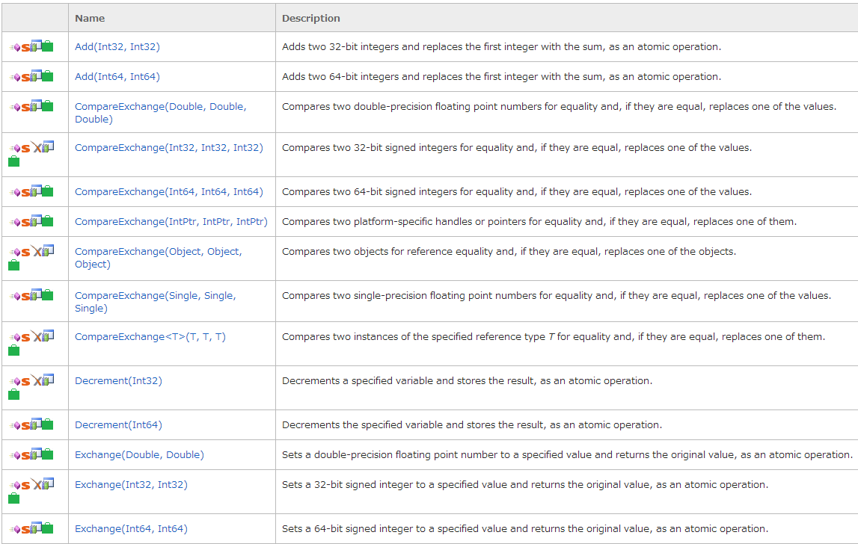
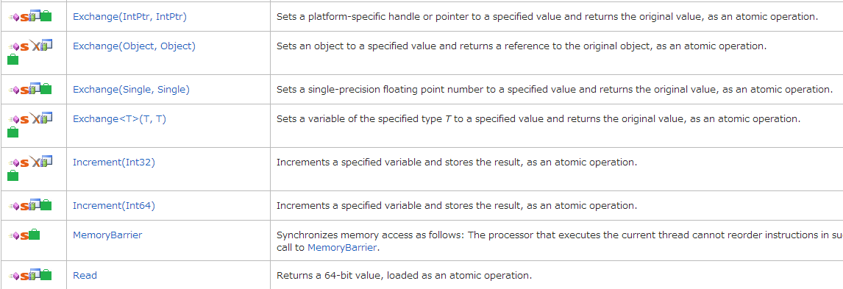

# Lock
  
## 일반적인 공유 리소스 동기화
`lock` 키워드 사용. 이것은 크리티컬섹션 이다.  
```
static readonly object locker = new object();

protected void ThreadFunc(object parameter)
{
	while (IsRunningThread)
	{
	    lock (locker)
               {
	        ....
	    }
	}
}
```
  
  
## 4가지 방식의 동기화 처리
- 단순한 블럭용 메소드
    - 다른 스레드 완료를 기다리던가 혹은 지정한 시간이 될때까지 기다린다. 
    - Sleep, Join, Task.Wait 등
- Lock
    - 복수의 스레드가 동시에 공유 리소스를 접근할 때 배타 lock은 대중적이다. 
    - 배타 lock을 사용하면 한번에 하나의 스레드만 접근할 수 있다. 
    - 가장 표준적인 배타 lock은 lock(Monitor.Enter/Monitor.Exit), Mutex, SpinLock 이다. 
    - 배타 lock이 아닌 lock은 Semaphore, SemaphoreSlim, Reader/Writer locks이 있다.
- 시그널
    - 다른 스레드에서 통지를 받을 때까지 스레드를 정지할 수 있다. 
    - 시그널을 사용하면 필요 없는 비효율적인 폴링을 피할 수 있다. 
    - 시그널로서 2종류의 시그널이 자주 사용된다. Event wait handle 과 Monitor의 Wait/Pulse 메소드 이다. 
    .NET4.0에서는 CountdownEvent 나 Barrier 클래스가 새로 추가 되었다.
- 블럭하지 않는 동기 처리
    - CLR 및 C#은 프로세서 레벨에서는 lock 하지 않는 동기처리를 제공한다. 
    - Thread.MemoryBarrier, Thread.VolatileRead, Thread.VolatileWrite, volatile 키워드, Interlocked 클래스. 
  
  

## lock 스테이트먼트
- 가장 유명한 배타 lock으로 lock과 Mutex가 있다.
- 이 2가지 중 lock이 성능이 좋으면서 사용이 간단하다.
- Mutex는 서로 다른 프로세스에 동작하는 애플리케이션에 배타 lock을 걸 때 사용한다.
- NET4.0에서는 아주 높은 부하의 병렬 처리 상태에서 lock을 걸기 위해서 SpinLock이 새로 생겼다.
- lock 대기 상태에 걸린 스레드의 상태는 ThreadState과 WaitSleepJoin으로 된다.
  
```
class ThreadSafe
{
  static readonly object _locker = new object();
  static int _val1, _val2;
 
  static void Go()
  {
    lock (_locker)
    {
        if (_val2 != 0) Console.WriteLine (_val1 / _val2);
        _val2 = 0;
    }
  }
}
```
     
  
  
## 성능
- lock을 가능한 빨리 해제 되어야 한다.
- 2010년 대의 컴퓨터에서는 lock 경쟁이 없는 상태에서는 적어도 20 나노 초 이내에는 lock이 해제 되는 것을 기대하고 있다.
- lock 경합이 있으면 스레드가 스케쥴 되때까지의 시간 보다도 길 때는 컨텍스트 스위칭이 발생하여 오버헤드는 밀리초 단위에 가깝게 된다.
- 만약 lock을 아주 짧은 시간으로 유지한다면 컨텍스트 스위치는 SpinLock 클래스를 사용하여 회피하는 것이 가능하다.
- lock을 장시간 유지하면 동시 실행성이 저하된다. 또 데드락 가능성도 높아진다.
  
  
  
## 동기화 범위
- 하나의 스레드만 변수나 코드 실행을 할 수 있도록 한다.
    - lock(Monitor.Enter/Monitor.Exit)
    - Mutex
- 지정한 수 이하의 스레드가 변수나 코드 실행을 할 수 있도록 한다.
    - SemaphoreSlim
    - Semaphore
- 복수의 스레드에서 읽고, 하나의 스레드에서 쓰기를 보증한다.
    - ReaderWriterLockSlim
    - ReaderWriterLock
  
|     lock 종류                           |     프로세스                |     오버헤드    |
|-----------------------------------------|-----------------------------|-----------------|
|     lock(Monitor.Enter/Monitor.Exit)    |     같은 프로세스           |     20ns        |
|     Mutex                               |     다른 프로세스도 가능    |     1000ns      |
|     SemaphoreSlim                       |     같은 프로세스           |     200ns       |
|     Semaphore                           |     다른 프로세스도 가능    |     1000ns      |
|     ReaderWriterLockSlim                |     같은 프로세스           |     40ns        |
|     ReaderWriterLock                    |     같은 프로세스           |     100ns       |
   
  
  
## Monitor 클래스
C#의 lock을 사용하면 둘러싼 블록을 컴파일 할 때 내부적으로 try-finally와 Moniter.Enter/Monitor.Exit로 둘러싼 형태로 바꾼다.  
```
static void Go()
{
	lock (_locker)
	{
	  if (_val2 != 0) 	  { 
                 …
             }
	  _val2 = 0;
	}
}
```
  
```
static void Go()
{
	Monitor.Enter (_locker);
	try
	{
	  if (_val2 != 0) 
             {
               ….
             }
	  _val2 = 0;
	}
	finally { Monitor.Exit (_locker); }
}
```  
위 코드들처럼 lock 키워드를 사용하면 컴파일할 때 Moniter로 바뀐다. 즉 lock을 사용한다는 것은 Moniter를 사용하는 것이다.  
  
Monitor.Enter 메소드를 호출하기 전에 Monitor.Exit 메소드를 호출하면 예외가 발생한다.Monitor.TryEnter 메소드도 있다.  
  
```
static readonly object _locker = new object();
 
static void Main()
{
  lock (_locker)
  {
     AnotherMethod();
     // We still have the lock - because locks are reentrant.
  }
}
 
static void AnotherMethod()
{
  lock (_locker) { Console.WriteLine ("Another method"); }
}
```
  
  
## 메소드 전체에 lock 걸기
**긴 메소드에서 사용은 피해야 한다**  
```
[System.Runtime.CompilerServices.MethodImpl(
    System.Runtime.CompilerServices.MethodImplOptions.Synchronized)]
private void WriteNumber()
{
    if (count < 10)
    {
        count++;
        Console.WriteLine(count);
    }
}
```
  
  
## Synchronized
  
```
// 스레드 세이프하지 않은 ArrayList 오브젝트를 만든다.
var al = new System.Collections.ArrayList();

// al를 기초로한 스레드 세이프한 ArrayList 랩퍼 만들기 
var syncdAl = System.Collections.ArrayList.Synchronized(al);
또는
var syncdAl = ArrayList.Synchronized(new ArrayList());

// syncdAl로의 접근이 스레드 세이프한지 조사한다.
if (syncdAl.IsSynchronized)
{
    Console.WriteLine("syncdAl는 스레드 세이프하다.");
}
else
{
    Console.WriteLine("syncdAl는 스레드 세이프하지 않다.");
}
```  
    
  
   
## SyncRoot를 사용한 컬렉션 동기화
    
```
private static System.Collections.ArrayList syncdAl;

public static void Main()
{
    // syncdAl은 컬렉션 열거에는 스레드 세이프하지 않다.
    syncdAl =System.Collections.ArrayList.Synchronized(
        new System.Collections.ArrayList());

    for (int i = 0; i < 100; i++)
    {
        syncdAl.Add(i);
    }

    var t = new Thread(new ThreadStart(MyThread));
    t.Start();

    syncdAl.RemoveAt(0);

    Console.ReadLine();
}

private static void MyThread()
{
    lock(syncdAl.SyncRoot)
    {
        foreach (int i in syncdAl)
        {
            Console.Write(i);
        }
    }
}
```


## ReaderWriterLock
- 복수의 스레드에서 공유 리소스를 사용할 때 읽기는 복수의 스레드 접근을 허용하고, 쓰기에는 하나의 스레드만을 허용할 때는 ReaderWriterLock이 아주 효율적이다.
- 읽기는 빈번한데, 쓰기는 간혹 있는 경우라면 아주 좋다.
    
```
class Class1
{
    private static System.Threading.ReaderWriterLock rwl =
        new System.Threading.ReaderWriterLock();
    private static string resource = "0123456789";

    public static void Main()
    {
        // 스레드 중 반은 공유 리소스에서 읽기 메소드를
        // 나머지 반은 공유리소스에서 쓰기 메소드를 실행
        for (int i = 0; i < 200; i++)
        {
            if (i % 2 == 0)
            {
                (new System.Threading.Thread(
                    new System.Threading.ThreadStart(
                    ReadFromResource))).Start();
            }
            else
            {
                (new System.Threading.Thread(
                    new System.Threading.ThreadStart(
                    WriteToResource))).Start();
            }
        }

        Console.ReadLine();
    }
    private static void ReadFromResource()
    {
        // 리더 락을 얻는다
        rwl.AcquireReaderLock(System.Threading.Timeout.Infinite);

        // 공유 리소스에서 읽기는 스레드 세이프
        Console.WriteLine(resource);

        // 락 카운드를 줄인다. 0이 되면 락이 풀린다
        rwl.ReleaseReaderLock();
    }

    private static void WriteToResource()
    {
        // 라이터 락을 얻는다
        rwl.AcquireWriterLock(System.Threading.Timeout.Infinite);

        // 공유 리소스에 쓰기(읽기도)가 스레드 세이프
        string s = resource.Substring(0, 1);
        resource = resource.Substring(1);
        System.Threading.Thread.Sleep(1);
        resource += s;

        // 라이터 락 카운트를 줄인다. 0이 되면 락이 풀린다
        rwl.ReleaseWriterLock();
    }
}

```  


## 이벤트
**ManualResetEvent, AutoResetEvent, Mutex 클래스는 Win32 동기 핸들을 캡슐화 한 것으로 Monitor에 비해서 성능이 나쁘다**
   
### WaitHandle(대기핸들)
- 대기핸들의 상태는 '시그널 상태'와 '비 시그널 상태' 2가지가 있다.
- 대기핸들을 어떤 스레드에서 소용하고 있지 않다면 '시그널 상태', 소유하고 있다면 '비 시그널 상태'
- WaitHandle.WaitOne 메소드를 사용하면 대기 핸들이 시그널 상태가 될 때까지 스레드를 블럭한다.
- WaitHandle에서 파생된 클래스로 ManualResetEvent, AutoResetEvent, Mutex가 있다.  

  
### ManualResetEvent
  
```
class Class1
{
    private static System.Threading.ManualResetEvent manualEvent;

    public static void Main()
    {
        // 비 시그널 상태로 ManualResetEvent 오브젝트를 만든다
        manualEvent = new System.Threading.ManualResetEvent(false);

        var t = new Thread( ThreadStart(DoSomething) ) ;
        t.Start();

        Console.WriteLine("Enter 키를 눌러주세요");
        Console.ReadLine();

        // 시그널 상태로 바꾼다
        manualEvent.Set();

        Console.WriteLine("메인스레드 종료");
        Console.ReadLine();
    }

    private static void DoSomething()
    {
        Console.WriteLine("워커 스레드 시작");

        //시그널 상태가 될 때까지 스레드를 블럭한다
        manualEvent.WaitOne();

        Console.WriteLine("워커 스레드 종료");
    }
}
```
  
  
### AutoResetEvent
  
```
class Class1
{
    private static System.Threading.AutoResetEvent autoEvent1;
    private static System.Threading.AutoResetEvent autoEvent2;

    public static void Main()
    {
        // 비 시그널 상태로 ManualResetEvent 오브젝트를 만든다
        autoEvent1 = new System.Threading.AutoResetEvent(false);
        autoEvent2 = new System.Threading.AutoResetEvent(false);

        // 스레드를 2개 만들고 시작한다
        var t1 = new Thread(new ThreadStart(DoSomething1));
        var t2 = new Thread(new ThreadStart(DoSomething2));
        t1.Start();
        t2.Start();

        // manualEvent1를 시그널 상태로 한다
        autoEvent1.Set();
            Console.ReadLine();
    }

    // 다른 스레드에서 실행하는 메소드 1
    private static void DoSomething1()
    {
        for (int i = 0; i < 10; i++)
        {
            // manualEvent1가 시그널 상태가 될 때까지 스레드를 블럭
            autoEvent1.WaitOne();

            Console.WriteLine("1");

            // manualEvent2를 시그널 상태로 한다
            autoEvent2.Set();
        }
    }

    // 다른 스레드에서 실행하는 스레드 2
    private static void DoSomething2()
    {
        for (int i = 0; i < 10; i++)
        {
            // manualEvent2가 시그널 상태가 될 때까지 스레드를 블럭
            autoEvent2.WaitOne();

            Console.WriteLine("2");

            // manualEvent1을 시그널 상태로 한다
            autoEvent1.Set();
        }
    }
}
```
    

### ManualResetEventSlim
- 이미 System.Threading.ManualResetEvent 클래스라는 것이 있다.
    - ManualResetEventSlim은 ManualResetEvent의 경량판이다.
    - 짧은 시간에 대기하는 경우는 이것을 이용하는 것이 성능에 더 좋다 
- 비슷한 류로 SemaphoreSlim 클래스가 있는데 이것도 Samaphore 클래스의 경량판이다.
- ManualResetEvent 클래스와 기능은 거의 같다.
    - 단 Wait 메소드에 CancellationToken을 붙는 오버로드가 추가 되었다.
    - 캔슬토큰을 지정한 Wait 메소드의 경우 보통 시그널 상태가 될 때까지 대기하는 것과 동시에 취소 되었는지 여부를 조사한다.
    - 캔슬토큰을 지정한 경우 캔슬 조작이 발생하면 OperationCanceledException 예외가 발생하므로 try-catch가 필수 이다.
   
```
public class ManualResetEventSlimSamples01 : IExecutable
{
    public void Execute()
    {
        ManualResetEventSlim mres = new ManualResetEventSlim(false);
		
        ThreadPool.QueueUserWorkItem(DoProc, mres);
		
        Console.Write("메인 스레드 대기 중…..");
        mres.Wait(); 
        Console.WriteLine("종료");
		
        // Wait 메소드에 CancellationToken을 받아 들이는 오버로드를 사용
        mres.Reset();
		
        CancellationTokenSource tokenSource = new CancellationTokenSource();
        CancellationToken       token       = tokenSource.Token;
		
        Task task = Task.Factory.StartNew(DoProc, mres);
		
        // 캔슬 상태를 설정
        tokenSource.Cancel();
		
        Console.Write("메인 스레드 대기 중….");
        try
        {
	// CancellationToken을 지정하여 Wait 호출
	// 이 경우 아래의 조건 중 하나를 만족한 시점에 Wait가 해제된다
	//    ・ 다른 곳에서 Set이 호출되어 시그널 상태가 된다
	//    ・ CancellationToken이 캔슬된다
	//
	// 토큰이 캔슬된 경우 OperationCanceledException 이 발생하므로
	// CancellationToken을 지정한 Wait를 호출한 경우는 try-catch가 필수이다.
	//
	// 이번은 자식의 CancellationToken을 캔슬하고 있으므로
	// 태스크 처리에서 시그널 상태로 설정되는 것 보다 먼저 캔슬 상태로 설정된다
	// 그러므로 실행결과는 「*** 시그널 상태로 설정 ***」은 출력되지 않는다
	//
	mres.Wait(token);
        }
        catch (OperationCanceledException cancelEx)
        {
	Console.Write("*** {0} *** ", cancelEx.Message);
        }

        Console.WriteLine("종료");
    }
	
    void DoProc(object stateObj)
    {
        Thread.Sleep(TimeSpan.FromSeconds(1));
        Console.Write("*** 시그널 상태로 설정 *** ");
        (stateObj as ManualResetEventSlim).Set();
    }
}
```
  


### CountdownEvent
- ManualResetEventSlim 클래스와 비슷한 기능을 가진다. 다만 ManualResetEventSlim 클래스는 1회 Set 메소드를 호출하면 시그널 상태가 되지만  CountdownEvent는 문자대로 일정 회수의 카운트를 기다리고 0이 되면 시그널 상태가 된다.
- CountdownEvent 클래스도 캔슬토큰을 인자로 받을 수 있다취소가 발생하면 OperationCanceledException 예외가 발생한다.
  
```
public class CountdownEventSamples01 : IExecutable
{
    public void Execute()
    {
        // 초기 카운트 1의 CountdownEvent를 만든다        
        // 이 경우 어딘가에서 처리로 카운트를 하나 줄여야 한다
        // 카운트가 남아 있는 상태에서 Wait를 하고 있으면 언제까지라도 Wait를 빠져 나올 수 없다		
        using (CountdownEvent cde = new CountdownEvent(1))
        {
	Console.WriteLine("InitialCount={0}", cde.InitialCount);
	Console.WriteLine("CurrentCount={0}", cde.CurrentCount);
	Console.WriteLine("IsSet={0}", cde.IsSet);
			
	Task t = Task.Factory.StartNew(() => 
	{
	    Thread.Sleep(TimeSpan.FromSeconds(1));
				
	    // 카운트를 줄인다
	    // Signal 메소드를 인수 없이 호출하면 하나의 카운트를 줄일 수 있다
	    // (지정한만큼 카운트를 줄여주는 오버로드도 있다)
	    // CountdownEvent.CurrentCount가 0 상태에서 또 Signal 메소드를 호출하면
	    // InvalidOperationException (이벤트 카운트를 0 보다 작은 값으로 줄여버린)이 발생
	    
	    cde.Signal();
	    cde.Signal(); // 이 타이밍에서 예외가 발생
	});
			
			
	try
	{
                   t.Wait();
	}
	catch (AggregateException aggEx)
	{
	    foreach (Exception innerEx in aggEx.Flatten().InnerExceptions)
	    {
	        Console.WriteLine("ERROR={0}", innerEx.Message);
	    }
	}

	// 카운트가 0이 될 때까지 대기
	cde.Wait();
			
	// 현재 상태를 표시
	Console.WriteLine("InitialCount={0}", cde.InitialCount);
	Console.WriteLine("CurrentCount={0}", cde.CurrentCount);
	Console.WriteLine("IsSet={0}", cde.IsSet);
        }
    }
}	
```
  
```
// http://devlights.hatenablog.com/entry/20110324/p2
public class CountdownEventSamples02 : IExecutable
{
    public void Execute()
    {
        const int LEAST_TASK_FINISH_COUNT = 3;
		
        // 복수의 스레드에서 하는의 CountdownEvent을 시느널 한다
        // CountdownEvent을 자주 이용하는 패턴
        // N개의 처리가 규정 수 종료까지 메인 스레드의 진행을 대기한다
        // 아래 처리에서는 5개의 태스크를 만들고 3개가 끝난 시점에서
        // 메인 스레드는 처리를 속행하도록 한다
        // N개의 처리가 전부 끝날 때까지 메인 스레드의 속행을 대기하는 경우는
        // CountdownEvent의 카운트를 테스크 처리 수와 같도록 하면 좋다
	
        using (CountdownEvent cde = new CountdownEvent(LEAST_TASK_FINISH_COUNT))
        {
	Console.WriteLine("InitialCount={0}", cde.InitialCount);
	Console.WriteLine("CurrentCount={0}", cde.CurrentCount);
	Console.WriteLine("IsSet={0}", cde.IsSet);
			
	Task[] tasks = new Task[]
	{
	    Task.Factory.StartNew(TaskProc, cde),
	    Task.Factory.StartNew(TaskProc, cde),
	    Task.Factory.StartNew(TaskProc, cde),
	    Task.Factory.StartNew(TaskProc, cde),
	    Task.Factory.StartNew(TaskProc, cde)
	 };	
	// 3개 끝날 때까지 대기
	cde.Wait();
	Console.WriteLine("5개의 테스크 중 3개 종료");
	Console.WriteLine("메인 스레드 속행 개시….");
	Thread.Sleep(TimeSpan.FromSeconds(1));
			
	// 나머지 테스크를 대기
	Task.WaitAll(tasks);
	Console.WriteLine("모든 테스크 종료");
			
	Console.WriteLine("InitialCount={0}", cde.InitialCount);
	Console.WriteLine("CurrentCount={0}", cde.CurrentCount);
	Console.WriteLine("IsSet={0}", cde.IsSet);
        }
    }
	
    void TaskProc(object data)
    {
        Console.WriteLine("Task ID={0} 開始", Task.CurrentId);
        Thread.Sleep(TimeSpan.FromSeconds(new Random().Next(10)));
		
         // 이미 3개를 종료하고 있는지 여부를 확인하고, 아직이라면 시그널
         CountdownEvent cde = data as CountdownEvent;
         if (!cde.IsSet) {
	cde.Signal();
	Console.WriteLine("카운트를 줄인다. Task ID={0} CountdownEvent.CurrentCount={1}", Task.CurrentId, cde.CurrentCount);
         }
		
         Console.WriteLine("Task ID={0} 종료", Task.CurrentId);
     }
}	
```
  
  

## Interlocked
[MS Docs](https://docs.microsoft.com/ko-kr/dotnet/api/system.threading.interlocked?redirectedfrom=MSDN&view=net-5.0 )    
  
 
  
  
  
  
## Barrier
- Barrier 클래스는 병렬 처리를 복수의 페이즈 마다 협조 동작 시킬 때 사용한다. 다시말해 N개의 스레드를 특정 페이즈 마다 발을 맞추어서 다음 페이즈로 진행하듯이
- Barrier에서는 복수의 스레드가 전진하기 위해서 베리어 부근에 모두 모이이지 않으면 안된다.
- CountdownEvent와 비슷하게 보이지만 다음과 같이 다르다.
    - CountdownEvent은 특정 이벤트가 끝날 때까지 기다릴 때 사용하지만 Barrier는 동료 스레드를 기다릴 때 사용한다.
    - CountdownEvent은 Signal을 부르면 카운트가 줄어든다.
    - CountdownEvent.Wait를 호출한 스레드는 각각의 워커 스레드가 자신의 처리를 종료하고 카운트를 줄이는 것을 기다린다. 카운트가 0이 되는 시점에서 스레드가 동작한다.
- Barrier는 SignalAndWait를 호출하여 동료 스레드가 모일때까지 기다린다. 동료 스레드가 전원 SignalAndWait를 호출하는 시점에서 베리어가 해제 되어 각 스레드는 다음 페이즈로 나아간다.
- Barrier 클래스는 생성자에서 각 처리가 모인 시점에서 호출될 콜백을 넘길 수 있다.
- 이것을 이용하면 각각의 페이즈 단위에서 결과를 수집할 수 있다.
- 이 콜백이 호출되는 동안은 워커스레드는 블록 상태가 된다.다시말해 콜백이 실행되는 동안에는 워커스레드는 진행하지 않는다.
  
```
// http://devlights.hatenablog.com/entry/20110329/p1
public class BarrierSamples01 : IExecutable
{
    long _count; // 계산 값을 보존하는 변수
	
    public void Execute()
    {
        // Barrier 클래스는 병행 처리를 복수의 페이즈 마다 협조 동작 시키는 경우에 이용한다
        // 다시 말해 동시 실행 조작을 동기할 때 이용할 수 있다
        // Barrier 클래스를 인스턴스 화 할 때에 대상이 되는 병행처리 수를 생성자에 지정한다
        // 생성자에는 페이즈 마다 실행될 콜백을 설정 할 수도 있다
        // 뒤에는 Barrier.SignalAndWait를 각 병행 처리가 호출하면 된다.
        // 생성자에 지정한 수만큼 SignalAndWait가 호출된 시점에서 1 페이즈 종료가 된다
        // 설정한 콜백이 실행된다.
        // 각 병행처리는 SignalAndWait를 호출한 후Barrier에 지정한 처리 수 만큼 SignalAndWait가
        // 호출 될 때까지 블럭된다
        // 대상이 되는 병행 처리 수는 아래의 메소드를 이용하여 증감 시킬 수 있다
        //     ・AddParticipants
        //    ・RemoveParticipants
    
        // CountdownEvent, ManualResetEventSlim와 같이 이 클래스의 SignalAndWait 메소드도
        // CancellationToken을 받아 들일 수 있는 오버로드가 존재한다
        // CountdownEvent와 같이 이 클래스도 IDisposable를 구현하고 있으므로 using 가능
        // 5개의 처리를 지정한 페이즈 마다 동기 시키면서 실행.
        // 도한 페이즈 단위로 도중 결과를 출력하도록 한다.
        using (Barrier barrier = new Barrier(5, PostPhaseProc))
        {
	Parallel.Invoke(
		() => ParallelProc(barrier, 10, 123456, 2), 
		() => ParallelProc(barrier, 20, 678910, 3),
		() => ParallelProc(barrier, 30, 749827, 5),
		() => ParallelProc(barrier, 40, 847202, 7),
		() => ParallelProc(barrier, 50, 503295, 777)
		);
        }
		
        Console.WriteLine("최종 값：{0}", _count);
    }
	
    // 각 병행 처리 용 액션
    void ParallelProc(Barrier barrier, int randomMaxValue, int randomSeed, int modValue)
    {
        Calculate(barrier, randomMaxValue, randomSeed, modValue, 100);
		
        Calculate(barrier, randomMaxValue, randomSeed, modValue, 5000);
		
        Calculate(barrier, randomMaxValue, randomSeed, modValue, 10000);
    }
		
     // 계산 처리
    void Calculate(Barrier barrier, int randomMaxValue, int randomSeed, int modValue, 
                        int loopCountMaxValue)
    {
        Random    rnd   = new Random(randomSeed);
        Stopwatch watch = Stopwatch.StartNew();
		
        int loopCount = rnd.Next(loopCountMaxValue);
        Console.WriteLine("[Phase{0}] 루프 카운트：{1}, TASK:{2}", 
                                     barrier.CurrentPhaseNumber, loopCount, Task.CurrentId);
		
        for (int i = 0; i < loopCount; i++)
        {
	// 適度に時間がかかるように調整.
	if (rnd.Next(10000) % modValue == 0)
	{
	    Thread.Sleep(TimeSpan.FromMilliseconds(10));
	}
			
	Interlocked.Add(ref _count, (i + rnd.Next(randomMaxValue)));
        }
		
        watch.Stop();
        Console.WriteLine("[Phase{0}] SignalAndWait -- TASK:{1}, ELAPSED:{2}", 
                                  barrier.CurrentPhaseNumber, Task.CurrentId, watch.Elapsed);
		
        try
        {
	// 시그널을 발행하고 동료 스레드를 기다린다
	barrier.SignalAndWait();
        }
        catch (BarrierPostPhaseException postPhaseEx)
        {
	// Post Phase 액션에서 에러가 발생한 경우에 여기에 온다
	Console.WriteLine("*** {0} ***", postPhaseEx.Message);
	throw;
         }
    }
	
    // Barrier는 각 페이즈 마다 완료했을 때 호출 되는 콜백
    void PostPhaseProc(Barrier barrier)
    {
        // Post Phase 액션은 동시 실행하고 있는 처리가 모두 SignalAndWait를 호출하지 않으면
        // 발생하지 않는다
        // 즉 이 처리가 돌아가는 동안 다른 동시 실행 처리는 모두 블록 되는 상태가 된다
        long current = Interlocked.Read(ref _count);
		
        Console.WriteLine("현재 페이즈：{0}, 참가 요소 수：{1}", 
                                        barrier.CurrentPhaseNumber, barrier.ParticipantCount);
        Console.WriteLine("\t현재 값：{0}", current);
		
        // 아래 주석을 떼면 다음의 Post Phase 액션에서
        // 모든 SignalAndWait를 호출하고 있는 처리에서 BarrierPostPhaseException가 발생한다
        //throw new InvalidOperationException("dummy");
    }
}      
``` 
  


<br>     
    
